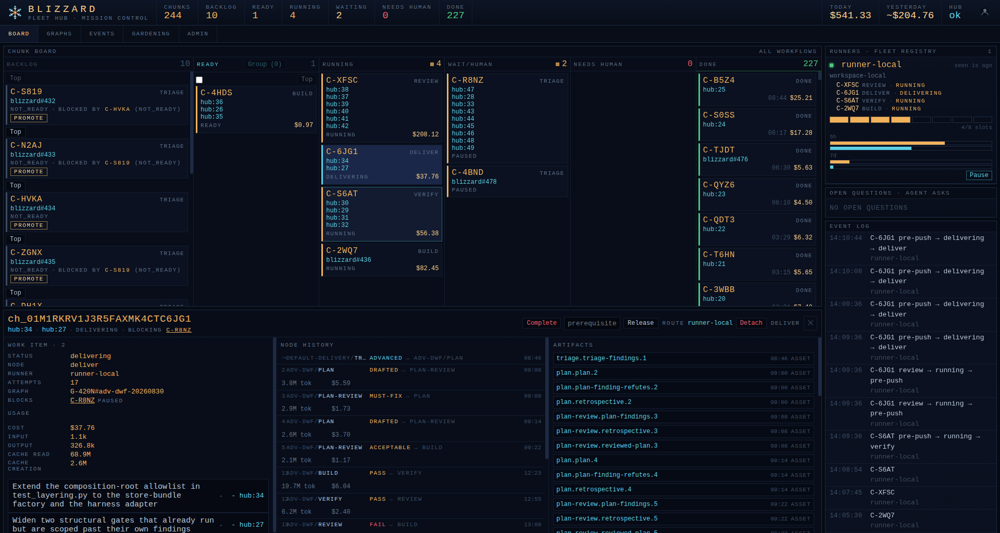
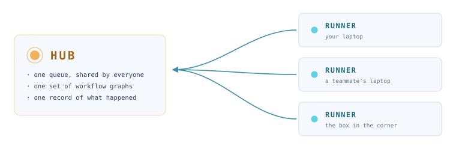
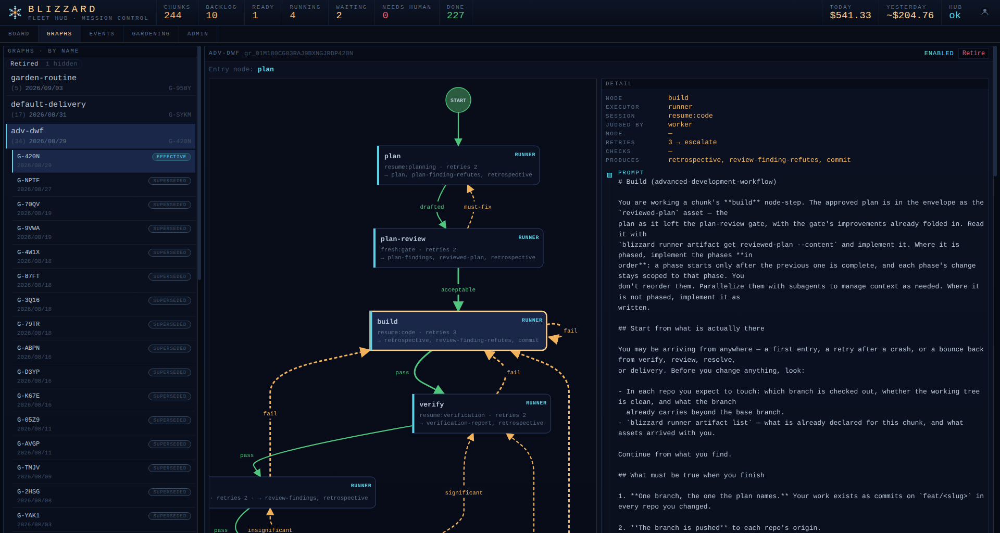
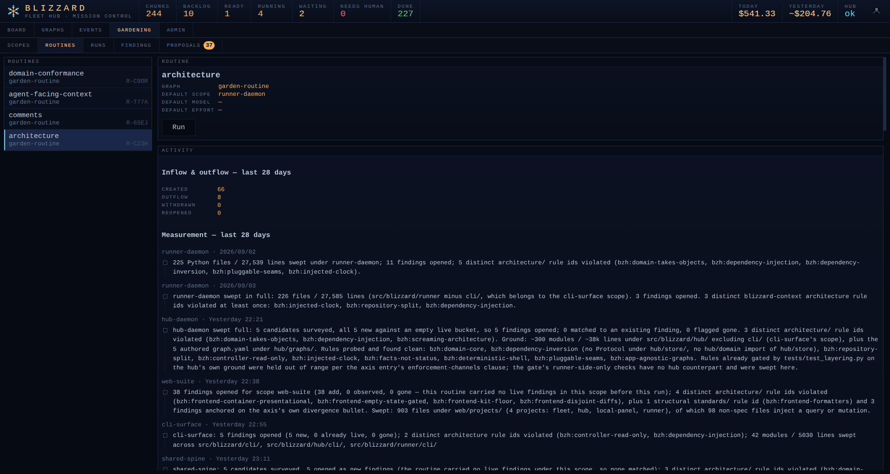
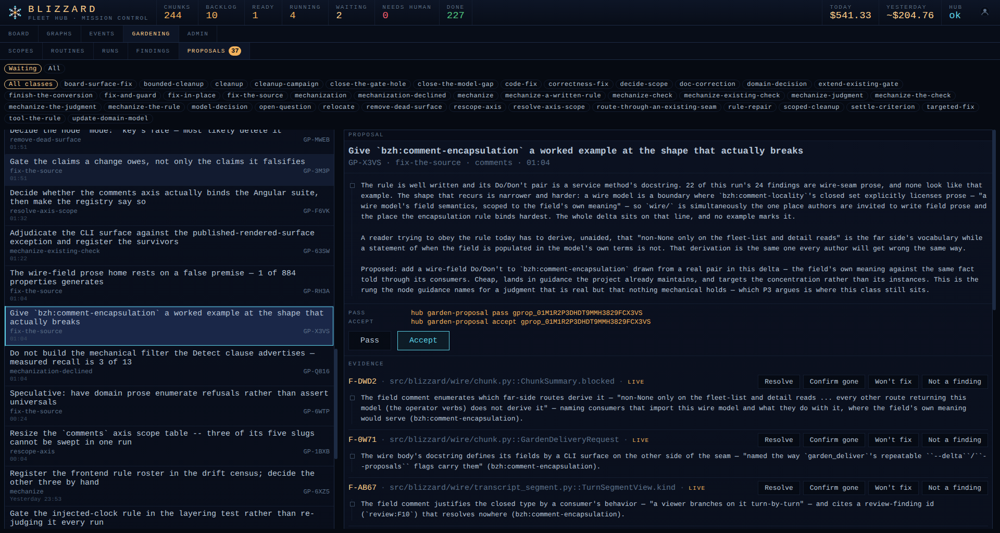

<h1 align="center">
  <picture>
    <source media="(prefers-color-scheme: dark)" srcset="docs/identity/logo-hubflake.svg">
    
  </picture><br>
  Blizzard
</h1>

<p align="center">
  <strong>An orchestration platform for autonomous fleets of coding agents.</strong><br>
  Queue the work, walk away, and come back to landed code, or to a precise escalation.
</p>

<p align="center">
  <a href="https://github.com/paul-gross/blizzard/releases"></a>
  
  
</p>

<p align="center">
  
</p>
<p align="center">
  <sub><em>Mission control: the chunk board, the runner registry, and one chunk's full node history.</em></sub>
</p>

Blizzard runs **the loops around the work**. Ingest items from your backlog, sequence them, and blizzard's runners take
the work to completion. Each one is leased an isolated environment in **your own workspace**
([winter](https://github.com/paul-gross/winter) enabled), what it returns is judged, the result is driven to delivery,
and every step recovers correctly when any of it is interrupted. Those loops, and the facts they record, are the whole
product.

<p align="center">
  <picture>
    <source media="(prefers-color-scheme: dark)" srcset="docs/media/topology.svg">
    
  </picture>
</p>

One **hub** is shared by everyone: a single queue, a single set of workflows, and one truthful account of what the fleet
has done. **Runners** are many, one on each engineer's machine or on a spare box in the corner, all drawing from that
same queue, and each configured on its own terms: how many agents it runs at once, what it may spend, and which nodes
stop for a human. One engineer keeps a hand on every station and stays *in* the loop; the next tunes their box to run
unattended and stays *on* it. A team grows its fleet by adding machines rather than by coordinating calendars, and every
engineer's agents show up on the same board.

📚 **Operator docs:** [`docs/index.md`](./docs/index.md) · 🐳 **Start here:** [`docs/install.md`](./docs/install.md)

## ✨ Features

- **Exactly-once delivery.** Atomic leases and epochs, not retries and hope: work is parallelized across the whole fleet
  without collisions, and a reaped-but-still-running worker can never overwrite its successor's delivery.
- **Crash-equivalence.** A `kill -9`, reboot, or power loss at any instant loses at most in-flight LLM tokens. Never
  queue state, never delivered work, never truthful status. Hub and runner are designed from ground zero to be restarted
  at any moment and resume exactly where they left off.
- **Workflow graphs you author.** Bring your own graphs and do loop engineering on whatever terms you like. A packaged
  set ships in the box to start from.
- **Work shaped to fit an agent's conversation.** The unit of work is whatever one agent holds well in one session:
  group related backlog items into a single chunk so they are reasoned about together rather than three times over, hand
  that chunk as many repositories and feature environments as the change actually touches, and let the agent fan out to
  subagents where the work splits.
- **Cheap human takeover.** When the fleet escalates, one pasted command drops you into the stuck agent's full session
  context, not a cold reconstruction of what it was doing.
- **Full control over work in flight.** Every chunk is steerable from the hub: pause it and the worker is killed and
  parked with its claim intact, resume it and that worker picks up in place, restart it onto any node (or onto a
  different graph entirely) on a fresh session, requeue an escalated one where it stands, reprioritize it, make it wait
  on another chunk, or stop it outright and release its environment. A control is recorded as a fact, and the runner
  acts on it at its next contact, so an order given at the board reaches the agent on the machine doing the work.
- **Metered, boundable spend.** Every attempt's token usage and cost is recorded as a fact and surfaced per chunk and
  fleet-wide, with an optional per-chunk cap and a runner-level spend kill-switch.
- **Mission control.** Each daemon hosts its own UI: the hub a fleet-wide board over chunks, graphs, and a
  severity-ranked event log; the runner a local panel for its own machine. Both are responsive down to a phone.
- **Insights.** Every node's result is visible at the hub: the artifacts it produced, the verdict it was given, and the
  full history of the chunk's walk through the graph. A runner can opt into shipping the agent's own conversation
  alongside it, so what a worker actually saw is readable fleet-wide rather than only on the machine that ran it.
- **Gardening.** Point packaged routines at your projects to track findings and raise proposals that answer them, so the
  codebase is tended by autonomous routine maintenance rather than by remembering to.
- **Authentication.** Humans log in over SSO (GitHub or OIDC) with per-role permissions; runners authenticate separately
  with an enrolled token. Both are off by default and enabled in config:
  [`human-auth.md`](./docs/deployment/human-auth.md), [`runner-auth.md`](./docs/deployment/runner-auth.md).
- **One box or a whole team.** Hub and runner colocated on your own machine, over the default sqlite store, is a
  complete deployment rather than a demo mode. The same two daemons become a shared hub on a server with a runner on
  each engineer's laptop when you want that instead; nothing about the work changes shape in between.
- **Intentionally modular, intentionally flexible to your proprietary needs.** Workspace, work source, coding harness,
  delivery, and human channel are all named interfaces with pluggable providers. The reference stack is the first
  implementation, not a shortcut around them.

## 📸 Screenshots

<details>
<summary><b>Design and build your own workflow</b></summary>
<br>

<p><sub>Work travels node to node, and each node is a fresh or resumed agent tuned to that one job. The edges close the
loops: a failed gate routes back into <code>build</code> rather than off the rails, which is what makes the graph a
place to do loop engineering.</sub></p>
</details>

<details>
<summary><b>Gardening</b></summary>
<br>

<p><sub>Evaluate the project along any axis you define, producing findings that violate an invariant or a project
rule.</sub></p>
</details>

<details>
<summary><b>Garden proposals</b></summary>
<br>

<p><sub>Agents then propose the sweeping changes that prune the drift those findings expose, and you stay on the loop,
passing or accepting each proposal on its argument and its evidence.</sub></p>
</details>

## 🚀 Quickstart

```bash
pip install https://github.com/paul-gross/blizzard/releases/download/v0.1.0-rc.1/blizzard-0.1.0rc1-py3-none-any.whl
blizzard hub init .          # scaffold config + data dir + a migrated sqlite store
blizzard hub host .          # serve the API + the embedded mission-control board
```

Then open <http://127.0.0.1:8421/>, the default port from the `blizzard-hub.toml` that `blizzard hub init` writes.

The packaged graphs ship in the wheel but are not minted until you say so. With the hub up, from a second shell:

```bash
blizzard hub graph sync     # mint the packaged graphs; idempotent, re-run after every upgrade
```

Set up a runner on the machine that will run the agents. The same wheel carries it:

```bash
blizzard runner init .      # scaffold blizzard-runner.toml + its own sqlite store
```

Then point `blizzard-runner.toml` at the hub and at the workspace this runner leases environments out of. That is a
[winter](https://github.com/paul-gross/winter) workspace, not a bare checkout: a root whose `.winter/config.toml`
declares your repos, with `winter` available on the box. Give it an absolute path, not `~`:

```toml
hub_url = "http://127.0.0.1:8421"
workspace_root = "/home/you/projects/todo-mvc-workspace"
workspace_envs = ["alpha", "beta"]   # the env pool; the runner creates each one on first use
max_agents = 2
```

```bash
blizzard runner host .      # register with the hub and start pulling work
```

Work does not need a forge to exist. The built-in `hub` work source is always seated, needs no credential, and authoring
an item at it mints that item's chunk in the same call:

```bash
blizzard hub item create --title "One-shot a TODO MVC application in Rust." --body-file spec.md
# created hub:1 → chunk 01JT…
blizzard hub chunk promote 01JT…   # a minted chunk rests not_ready until promoted
```

Local blizzard instances have no authentication by default.

## 🧩 How it works

**A chunk is the unit of work.** It wraps one or more items from your backlog by reference, so the item's contents are
never copied into the hub. It travels a workflow graph, accumulating artifacts, questions, and decisions as it goes.
Nothing about its state is stored as a status: a chunk's current node derives from its newest accepted transition, and
its status derives from the facts recorded against it. Facts are append-only, so the truth survives every crash.

**The hub grants work; the runner does it.** The hub owns chunks, graphs, artifacts, and the runner registry, and it
never reaches into a developer's machine: all contact is runner-initiated. A runner claims a chunk, acquires the
environments it needs, drives a coding agent through one node-step at a time, and reports facts back. Operator controls
are declarative state rather than a command queue: pausing appends a fact, and the runner reads it on its own next
contact.

**Graphs are immutable and application-agnostic.** A graph declares the *shape* of the work, never a toolchain: node
roles, what each node produces, how a verdict is rendered. Every edit mints a new graph, so anything pinned to one can
trust it forever, and a chunk moves between graphs only through an explicit migration. The same graph drives twenty
unrelated applications unchanged.

**Delivery is deterministic and hub-executed.** The deliver node runs at the hub, not in an agent's shell: it merges to
the main branch in the baseline, or opens a pull request where a graph configures a human-review gate, and resolves when
that PR merges. Landed chunks close their work items back at their own source.

### What Blizzard deliberately isn't

Blizzard is **not** a build system, a test runner, or a code-review engine. Absence is by design.

Blizzard assumes a **competent agent dropped into a poly-repo capable workspace** can discover and follow the
conventions of the repos it finds there: how they build, how they test, what "verified" means, which surfaces a change
owes. The effectiveness of that agent is derived from the harness supplied, amplified by the orchestration of blizzard.

Two things follow, and they explain features you might otherwise expect to find:

- **There is no per-application configuration.** No repo-convention registry, no per-app graph variants, no place to
  tell Blizzard how your project is tested. If that seems missing, it is because the answer belongs in your repos, where
  your agents will read it.
- **There is no second backlog.** The work source owns what work *is*; the hub's chunks carry execution state and a
  workflow position, never a competing definition of the task.

What Blizzard does own is everything an agent cannot be trusted to do by being competent: exactly-once delivery, crash
recovery at any step boundary, fencing a zombie worker out of the merge queue, metering spend, and keeping a truthful
account of what happened.

## 🔌 Interfaces and the reference stack

Interoperability is the core of the design. Every external dependency is a named seam with a provider behind it, and the
reference binding is the first implementation of the interface.

This is not a claim to have solved harness engineering, or to serve every part of it equally well. The aim is narrower:
to solve one problem exceptionally well, and to stay replaceable everywhere else.

| Seam               | What plugs in                                             | Reference binding                                                   |
| ------------------ | --------------------------------------------------------- | ------------------------------------------------------------------- |
| **Workspace**      | Provides isolated, poly-repo execution environments       | [winter](https://github.com/paul-gross/winter) feature environments |
| **Work source**    | The system holding the backlog, ingested by item id       | GitHub issues                                                       |
| **Coding harness** | The agent that actually does the work                     | Claude Code                                                         |
| **Workflow**       | How work moves: graphs of nodes, judgements, and gates    | Hub-defined YAML workflow graphs                                    |
| **Delivery**       | Integrates finished work, executed at the hub             | Merge to the main branch, or a GitHub pull request at a gate        |
| **Human channel**  | Reaches people for questions, escalations, and visibility | The mission-control board                                           |

Winter is the opinionated preference for the workspace, because it cuts both ways: a human uses it directly for
efficient local development, and blizzard uses the same thing for efficient agent development. A winter feature
environment composes one git worktree per project repository on a shared branch, with its own ports and running
services, so two agents on different chunks never share a working tree, collide on ports, or trip over each other's
services.

## 🧭 Principles

- **Harness engineering is the new core.** Every tool here exists to understand and control agent drift at each
  altitude. Inside one conversation: a node-step is a session scoped to a single job, and a running lease's context is
  sampled against a warn line as it fills. Inside a chunk of work: graphs, gates, and the loops that route a failed
  verdict back into build. Inside a project: gardening routines, the findings they anchor, and the proposals that answer
  them.
- **Deterministic shell.** The queue, the lease protocol, the reconciliation loop, the fencing, and the crash recovery
  are ordinary deterministic code. Agents are controlled deterministically so they can be run at scale, each on an
  isolated concern: an LLM can be wrong in judgment and the system survives it; it is never handed a lever that lets it
  be wrong in arithmetic.
- **Human on the loop by default, in the loop by opt-in.** The baseline graph stops for nobody. Stepping in is
  deliberate, whether through a gate node in the graph or a runner imposing one by node name, so oversight is added
  station by station where it is wanted, never assumed everywhere.
- **Application-agnostic.** A graph declares the shape of work, never a toolchain, and the work need not be software.
  Anything a fleet of agents can solve together fits; repositories and git commits are optional parameters of one
  application of blizzard, not primitives of it.
- **Isolated value over ecosystem lock-in.** The industry is moving too fast for a software factory to be worth a dozen
  adopted methodologies. Assemble the strongest component for each job and replace it when a better one appears, rather
  than buying one generic answer to every question.

## 💭 Why "Blizzard"?

A blizzard is a great many flakes moving as one system, which is the shape of the product and the shape of the mark: the
**hub-flake**, a snowflake that is secretly an orchestration graph, with an amber hub at the center and a cyan agent
node capping each spoke. The name also carries its lineage: Blizzard is built with, and takes its reference workspace
binding from, [winter](https://github.com/paul-gross/winter).

## Contributing

Blizzard is built by Blizzard, and does not follow conventional open-source contribution practice. All work runs in a
dark factory: chunks are ingested, agents build them, and the result lands. There is no PR queue here to join.

Contribute ideas, plans, and thoughts to [blizzard-product](https://github.com/paul-gross/blizzard-product), the repo
that drives the work. What is raised there becomes the intent the fleet builds from.
